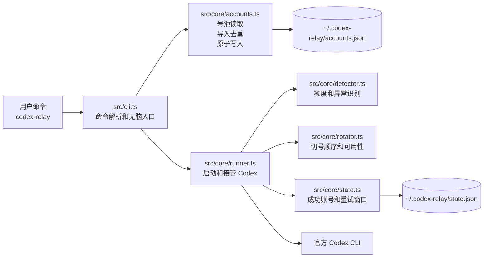
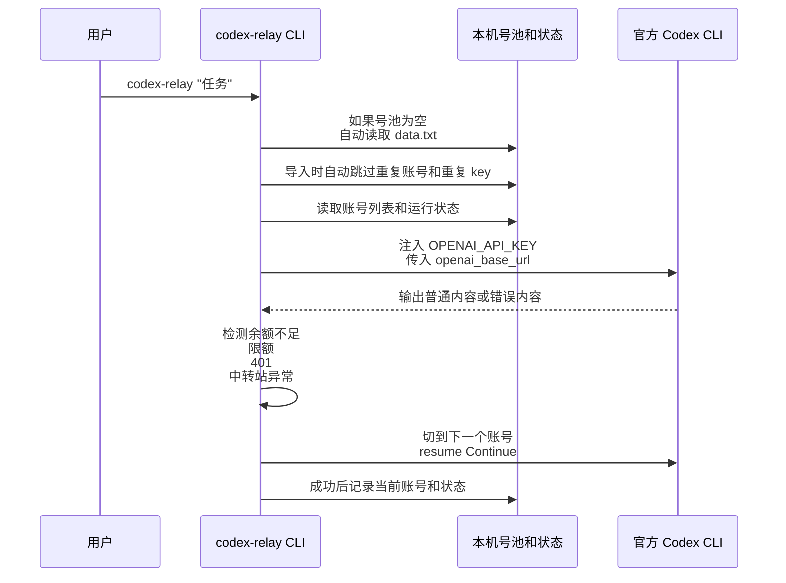
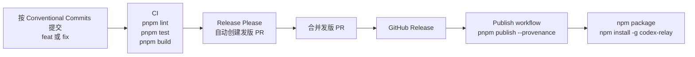

# codex-relay 项目说明

`codex-relay` 是一个给官方 Codex CLI 套在外层用的中转站号池管理工具。用户把多个中转站地址和 key 放进 `data.txt`，工具负责导入、去重、切号、恢复上下文，并在当前 key 没余额、限额、失效或中转站异常时继续尝试下一个可用账号。

## 技术栈选型

- Node.js 22 LTS：只面向一个当前 LTS 大版本，减少兼容分支。
- TypeScript + ESM：类型约束清楚，打包结果仍然是轻量的 Node CLI。
- commander：负责命令解析，代码直接、依赖小。
- zod：校验本地账号文件和运行状态文件，避免脏数据进入切号流程。
- strip-ansi：把 Codex 输出里的控制字符剥掉后再识别错误。
- node-pty 可选依赖：可用时提供更接近真实终端的 Codex 运行体验；不可用时自动回落到普通子进程。
- Vitest：覆盖导入、去重、切号、恢复、错误识别、状态写入等核心行为。
- pnpm：开发和 CI 统一使用 pnpm。
- GitHub Actions + Release Please：推送后自动校验，合并发版 PR 后自动发布 npm。

## 主要功能

- 号池管理：`add`、`list`、`use`、`remove`。
- 无脑导入：`setup` 默认读取当前目录 `data.txt`；第一次直接运行任务时，如果本机号池为空，也会自动导入 `data.txt`。
- 自动去重：导入类操作会自动跳过重复账号名，以及重复的 `baseUrl + apiKey + model` 凭据，不要求用户手动检查大批量数据。
- 多中转站格式：支持多个 `base_url` 分段，每段下面放多个 key，也支持 JSON 号池和纯 key 文件。
- 切号保活：检测余额不足、额度耗尽、401、402、rate limit、中转站暂不可用等输出后自动换下一个账号。
- 上下文恢复：能识别 Codex 会话 id 时使用 `codex resume <session-id> Continue`；识别不到时回退到 `codex resume --last Continue`。
- 状态记录：成功账号和重试窗口写入本机状态文件，下次运行优先避开暂不可用账号。
- 原子写入：账号和状态 JSON 都通过临时文件加 rename 写入，避免半写入损坏配置。

## 架构图



## 执行流程



## 关键模块

- `src/index.ts`：npm 全局命令入口，只负责调用 CLI 主函数。
- `src/cli.ts`：所有用户命令的入口，负责自动导入、导入摘要、账号测试和 Codex 参数透传。
- `src/core/accounts.ts`：账号文件 schema、导入解析、批量新增、导入去重和原子保存。
- `src/core/runner.ts`：按账号启动 Codex，监听输出，判断是否切号，并执行 resume。
- `src/core/detector.ts`：从 Codex 输出里识别余额、额度、鉴权、限流和临时不可用信号。
- `src/core/rotator.ts`：根据首选账号、上次成功账号、请求账号和 retry 窗口计算切号顺序。
- `src/core/state.ts`：读取和写入运行状态。
- `src/utils/atomic.ts`：JSON 原子读写。
- `src/utils/paths.ts`：解析本机数据目录，默认是 `~/.codex-relay/`。

## 本地数据

```text
~/.codex-relay/
  accounts.json   # 账号池，包含 name、apiKey、baseUrl、model、addedAt
  state.json      # 当前索引、上次成功账号、暂不可用账号的恢复时间
```

项目根目录里的 `data.txt`、`data.json`、`切号工具.md` 都被 `.gitignore` 忽略，不会进入提交。

## 导入和去重规则

导入类命令包括 `import`、`setup`、首次运行时自动导入 `data.txt`。它们都走同一个合并逻辑：

1. 先解析输入文件，得到候选账号。
2. 用 zod 校验每条账号的 URL、key、名称和时间字段。
3. 读取现有 `accounts.json`。
4. 如果候选账号的 `name` 已存在，跳过。
5. 如果候选账号的 `baseUrl + apiKey + model` 已存在，跳过。
6. 只把新增账号追加到文件末尾。
7. 如果没有新增账号，不写文件，直接告诉用户导入 0 个、跳过多少个。

这样用户可以反复执行 `codex-relay setup`，也可以把很大的号池文件直接丢进来，不需要自己先手动排重。

## 发布流程



发布前只需要在 GitHub 仓库配置一次 `NPM_TOKEN`，具体步骤见 `docs/npm-publish-setup.md`。
