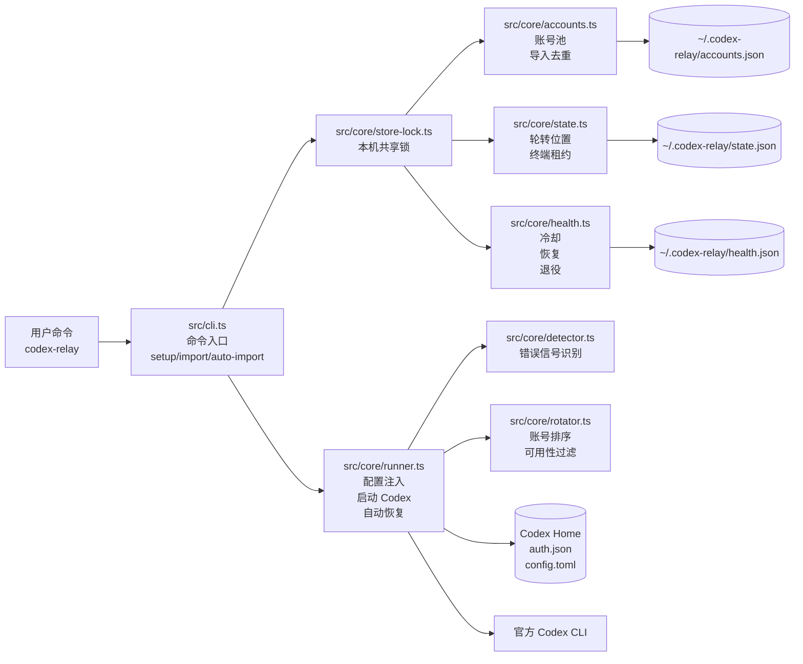
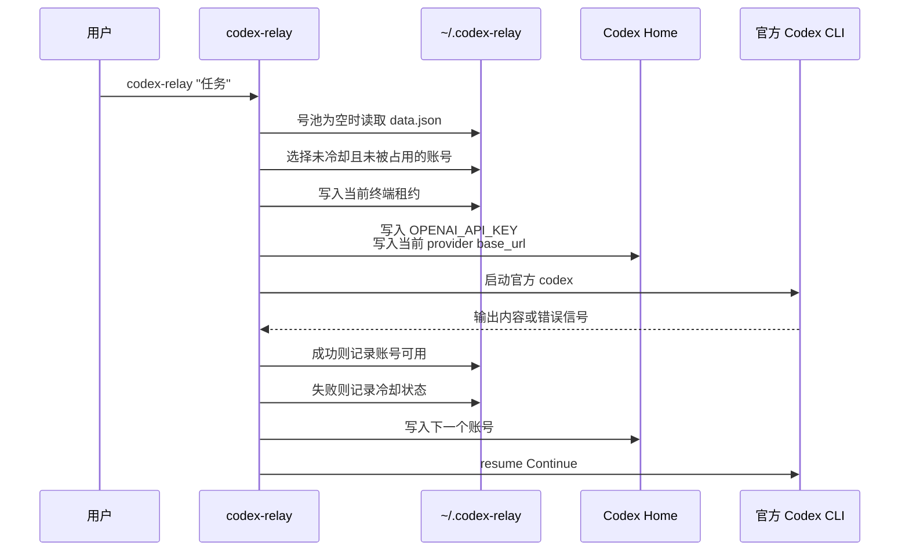
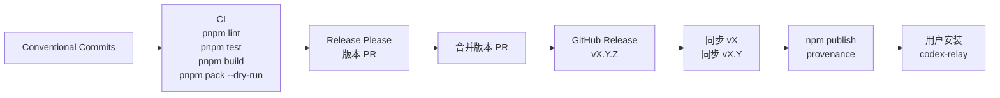

# codex-relay 架构说明

`codex-relay` 是官方 Codex CLI 的轻量外壳。它管理中转站号池，把当前选中的账号写入官方 Codex 配置，然后启动官方 `codex` 命令。项目自身只维护号池、健康状态和并发租约，不实现模型调用客户端。

## 技术栈

- Node.js 22 LTS：固定单一主版本，减少运行时分支。
- TypeScript + ESM：源码类型清晰，构建产物是标准 Node CLI。
- commander：提供标准 CLI 命令、`--help` 和 `--version`。
- zod：校验账号池、运行状态、健康状态和导入文件。
- node-pty：承载官方 Codex 交互式 TUI，缺失时保留非交互模式。
- Vitest：覆盖账号、状态、健康、切号、runner 和 CLI 行为。
- pnpm：开发、测试、打包和 CI 统一使用。
- GitHub Actions + Release Please：校验、版本、GitHub Release、tag 和 npm 发布自动化。

## 主要功能

- 账号管理：`add`、`list`、`use`、`remove`
- JSON 导入：`setup`、`import` 和首次运行自动读取顶层数组 JSON
- 自动去重：重复账号名、重复 `baseUrl + apiKey + model` 自动跳过
- Codex 配置注入：启动前写入 `auth.json.OPENAI_API_KEY` 和当前 provider 的 `base_url`
- 自动切号：额度、鉴权、限流、上游异常和中转站异常会触发账号切换
- 上下文恢复：优先使用明确的会话 id，兜底使用 `resume --last Continue`
- 健康状态：失败账号冷却，连续 10 天未恢复的账号进入退役记录
- 多终端协调：本机锁和短时租约避免多个项目同时抢同一个账号
- 轻量预检：`test` 只检查 `/models`，真实切号以实际 Codex 对话输出为准

## 目录结构

```text
src/
  index.ts            # 可执行入口
  cli.ts              # 命令解析、自动导入、管理命令
  types.ts            # 共享类型
  core/
    accounts.ts       # 账号池读取、导入、去重、保存
    detector.ts       # Codex 输出中的额度和异常信号识别
    health.ts         # 冷却、成功恢复、10 天退役
    rotator.ts        # 账号选择和可用性判断
    runner.ts         # Codex 子进程、配置注入、切号和恢复
    state.ts          # 默认账号、最近成功账号、多终端租约
    store-lock.ts     # 账号池共享写入锁
  utils/
    atomic.ts         # JSON 和文本原子写入
    lock.ts           # 文件锁实现
    paths.ts          # ~/.codex-relay 与 Codex Home 路径解析
    terminal.ts       # 终端状态恢复
```

## 架构图



## 执行流程



## 本地数据约定

号池状态默认保存在 `~/.codex-relay/`，可以通过 `CODEX_RELAY_HOME` 指向其他目录。

- `accounts.json`：`version`、`preferred`、`customQuotaPatterns`、`accounts`
- `state.json`：`currentIndex`、`lastSuccessfulAccount`、`leases`、`updatedAt`
- `health.json`：`accounts`、`retired`、`updatedAt`
- `store.lock`：本机多终端共享写入锁

官方 Codex Home 默认是 `~/.codex/`，如果设置了 `CODEX_HOME`，则沿用该路径。`codex-relay` 只写入当前账号必需的两项：

- `auth.json.OPENAI_API_KEY`
- `config.toml` 当前 `model_provider` 对应的 `[model_providers.<provider>].base_url`

## 导入规则

1. 导入文件必须是 JSON。
2. 顶层必须是数组。
3. 每项必须包含 `baseUrl` 和 `apiKey`。
4. `name` 和 `model` 可选。
5. `name` 缺失时按 `baseUrl` 生成可读账号名。
6. 同名账号跳过。
7. 相同 `baseUrl + apiKey + model` 跳过。
8. 已有账号保持原样，导入只追加有效的新账号。

## 发布流程



发布前只需要在 GitHub 仓库配置一次 `NPM_TOKEN`。配置步骤见 [docs/npm-publish-setup.md](docs/npm-publish-setup.md)，提交规范见 [docs/git-commit-guidelines.md](docs/git-commit-guidelines.md)。
