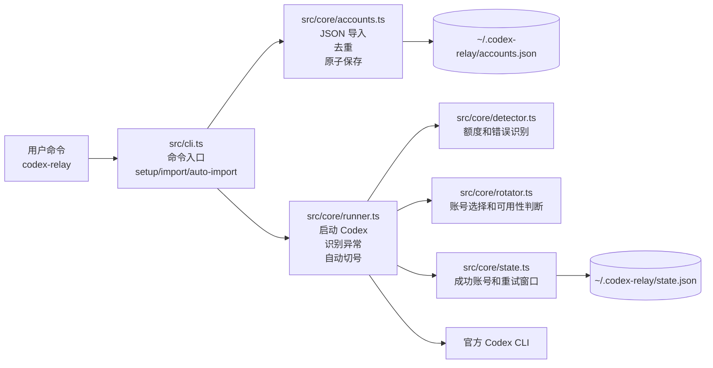
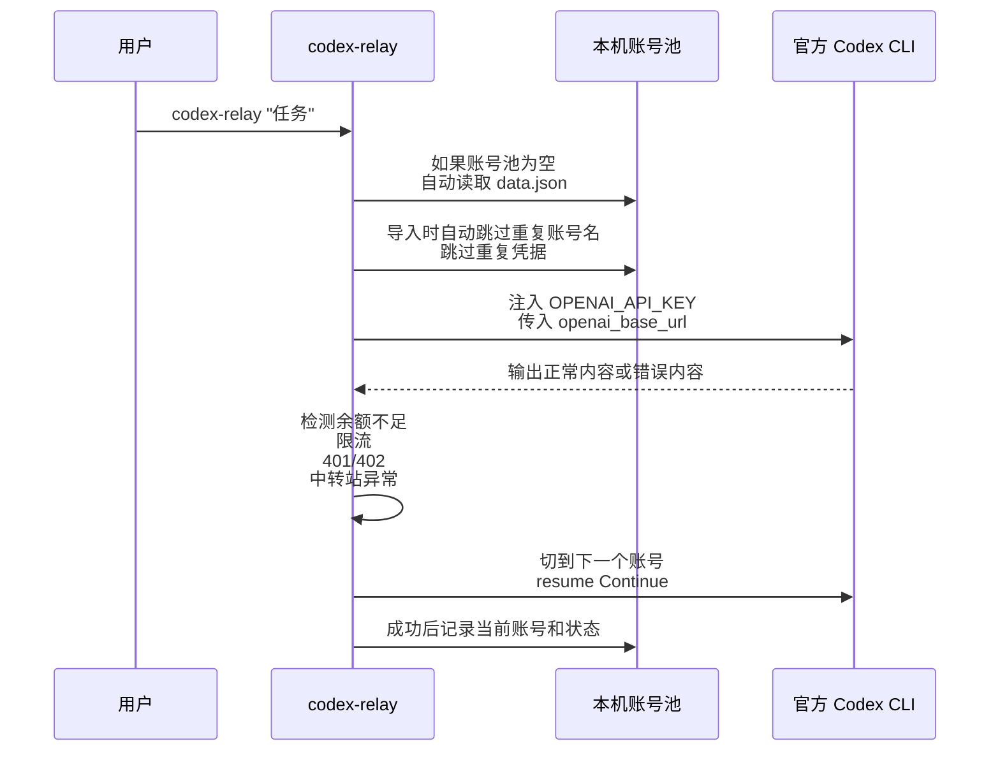

# codex-relay 架构说明

`codex-relay` 是一个极轻量的 Codex CLI 中转站号池管理器。它不接管用户的 Codex 配置文件，只是在外层管理一组 `baseUrl + apiKey` 账号，并在需要时自动切号、自动恢复上下文、自动继续执行未完成任务。

## 技术栈

- Node.js 22 LTS：单一主版本，减少兼容分支。
- TypeScript + ESM：类型清晰，最终产物仍然是标准 Node CLI。
- commander：命令解析轻，够用且直接。
- zod：本地 JSON 文件和导入数据校验。
- Vitest：覆盖核心逻辑和 CLI 行为。
- pnpm：开发、测试、打包和 CI 统一使用。
- GitHub Actions + Release Please：自动校验、自动发版、自动发布 npm。

## 主要功能

- 账号管理：`add`、`list`、`use`、`remove`
- JSON 导入：`import`、`setup` 和首次自动运行都只读取顶层数组 JSON
- 自动去重：重复账号名、重复 `baseUrl + apiKey + model` 自动跳过
- 自动切号：遇到额度、鉴权、限流或中转站异常时自动切换到下一个账号
- 上下文恢复：尽量恢复中断前的 Codex 会话
- 原子写入：账号池和状态文件使用临时文件 + rename

## 目录结构

```text
src/
  cli.ts              # 命令入口和自动导入入口
  core/
    accounts.ts       # 账号池读取、导入、去重、保存
    runner.ts         # Codex 子进程启动、输出检测、切号
    detector.ts       # 额度和异常信号识别
    rotator.ts        # 切号顺序和可用性判断
    state.ts          # 本地运行状态
  utils/
    atomic.ts         # JSON 原子读写
    paths.ts          # 本机数据目录
```

## 架构图



## 执行流程



## 数据约定

本机账号池保存在 `~/.codex-relay/accounts.json`，状态保存在 `~/.codex-relay/state.json`。

- `accounts.json`：`version`、`preferred`、`customQuotaPatterns`、`accounts`
- 单条账号：`name`、`apiKey`、`baseUrl`、可选 `model`、`addedAt`
- `data.json`：导入文件只接受顶层数组，每项是扁平对象

项目根目录里的 `data.txt`、`data.json`、`切号工具.md` 都被 `.gitignore` 忽略。

## 导入规则

1. 读取 JSON 文件。
2. 只接受顶层数组。
3. 每项必须包含 `baseUrl` 和 `apiKey`，`name` 和 `model` 可选。
4. 如果 `name` 重复，跳过。
5. 如果 `baseUrl + apiKey + model` 重复，跳过。
6. 如果 `name` 缺失，按 `baseUrl` 自动生成一个可读名字。
7. 只追加新增账号，不重写已有数据。

## 发布流程


发布前只需要在 GitHub 仓库里配置一次 `NPM_TOKEN`，具体步骤见 [docs/npm-publish-setup.md](docs/npm-publish-setup.md)。
