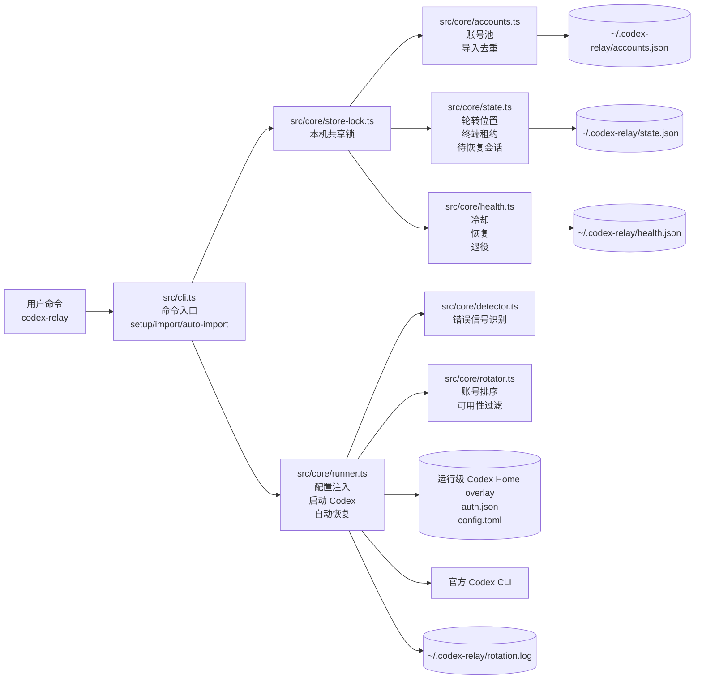

# codex-relay

`codex-relay` 是官方 Codex CLI 的中转站号池管理器。它维护多个 `baseUrl + apiKey` 账号，在额度耗尽、鉴权失败、限流或中转站异常时自动切换账号，并用明确的 Codex 会话 ID 恢复中断对话。

## 安装

```bash
npm install -g codex-relay-cli@latest
```

要求：

- Node.js `>=22 <23`
- 本机已安装官方 `codex` 命令
- 交互式 Codex TUI 需要 `node-pty`；它不是 Node.js 自带模块，缺失时可用 `codex-relay exec "任务"` 跑非交互任务

```bash
codex-relay --version
codex-relay --help
codex-relay doctor
```

## 账号配置

在项目根目录创建 `data.json`，只支持顶层数组，每项都是扁平对象：

```json
[
  {
    "baseUrl": "https://relay-a.example.com/v1",
    "apiKey": "sk-a1",
    "name": "relay-a-1"
  },
  {
    "baseUrl": "https://relay-a.example.com/v1",
    "apiKey": "sk-a2"
  },
  {
    "baseUrl": "https://relay-b.example.com/v1",
    "apiKey": "sk-b1",
    "model": "gpt-5.1-codex"
  }
]
```

字段：

- `baseUrl`：必填，中转站 OpenAI 兼容入口。
- `apiKey`：必填，中转站 key。
- `name`：可选，不写会按 `baseUrl` 自动生成，例如 `relay-example-com-1`。
- `model`：可选，该账号默认模型。

不支持 txt、纯 key 列表、分段 `base_url` 或 `{ "accounts": [...] }` 外层包裹格式。重复账号名、重复 `baseUrl + apiKey + model` 会自动跳过。

## 使用

```bash
codex-relay setup
codex-relay "帮我完成当前项目"
```

如果号池为空，直接执行 `codex-relay "任务"` 也会自动读取当前目录的 `data.json`。重复执行 `setup` 不会写入重复账号。

常用命令：

| 命令 | 作用 |
| --- | --- |
| `codex-relay setup [file]` | 从 JSON 初始化号池，默认 `data.json` |
| `codex-relay import <file>` | 从指定 JSON 追加导入账号 |
| `codex-relay add <name> --key <key> --base-url <url> [--model <model>]` | 手动添加账号 |
| `codex-relay list` | 查看账号、健康状态和 `in-use` 占用标记 |
| `codex-relay health` | 查看冷却和已退役账号 |
| `codex-relay test [name]` | 轻量检查 `/models`，只作诊断 |
| `codex-relay doctor` | 查看本机路径、Codex 命令、PTY、租约和待恢复会话 |
| `codex-relay reset --resume` | 清理待恢复会话 |
| `codex-relay reset --leases` | 清理本机账号租约 |
| `codex-relay reset cooldown <name>` | 立即解除单个账号冷却并恢复活跃 |
| `codex-relay reset cooldown --all` | 立即解除号池内全部账号冷却 |
| `codex-relay use <name>` | 设置默认优先账号 |
| `codex-relay remove <name>` | 删除账号 |
| `codex-relay --account <name> "任务"` | 本次运行指定账号 |
| `codex-relay --no-resume` | 本次启动不自动恢复中断会话 |
| `codex-relay exec "任务"` | 透传官方 Codex 非交互 `exec` 模式 |

退出 Codex 对话时优先输入 `/quit`。`Ctrl+D` 也可作为 EOF 退出；`Ctrl+C` 会被视为用户主动中断，不触发自动切号恢复。

## 切号与恢复

`codex-relay` 启动官方 Codex 后会透传所有输出，并识别余额不足、额度耗尽、401/402/403、限流、上游异常和中转站不可用等信号。

- 真实切号根据 Codex 对话输出判断，不依赖 `/models`。
- `codex-relay test` 的 `UNKNOWN probe-only` 只表示 `/models` 不能确认可用性，中转站仍可能正常对话。
- 失败凭证按 `baseUrl + apiKey` 进入 30 分钟冷却；多个账号条目使用同一个 key 时会共享冷却状态，避免重复选中同一失效 key。
- 每个 key 会记录冷却次数；累计达到 10 次时自动从号池移除，并写入 `health.json.retired`。
- 真实对话成功后会恢复可用，并清零该 key 的冷却次数。
- 需要人工恢复时可用 `codex-relay reset cooldown <name>` 重置单个账号，或用 `codex-relay reset cooldown --all` 一键重置全部账号冷却。
- 能识别明确会话 ID 时使用 `codex resume <session-id> Continue`；识别不到时停止自动切换，不猜测上一条会话。
- 每个项目目录的待恢复会话分别记录，多个终端不会互相抢恢复状态。

切号时 CLI 会显示当前账号，恢复后也会在 Codex 界面透传账号提示：

```text
[codex-relay] using relay-a (key sk-...abcd, baseUrl https://relay.example.com/v1).
```

## 本地文件

默认数据目录是 `~/.codex-relay/`，可用 `CODEX_RELAY_HOME` 改到其他位置。

- `accounts.json`：账号池。
- `state.json`：轮转位置、最近成功账号、短时租约、按工作区隔离的 `pendingResumes`。
- `health.json`：冷却、恢复和退役记录。
- `rotation.log`：最近 7 天切号审计日志，JSONL 格式。
- `instances/<run-id>`：临时 Codex Home overlay，运行结束自动清理。

官方 Codex Home 默认是 `~/.codex/`，如果设置了 `CODEX_HOME` 则沿用该路径。每次运行都会创建临时 overlay，链接官方 Codex 历史和会话文件，只在临时实例中写入当前账号：

- `auth.json.OPENAI_API_KEY`
- `config.toml` 当前 `model_provider` 对应的 `base_url`

多个项目、多个终端共用号池时，`store.lock` 和短时租约会优先分配未占用账号；账号不足时才共享，并在 CLI 中提示。

## 架构

`codex-relay` 是官方 Codex CLI 的轻量外壳，不实现模型客户端。核心职责是管理号池、选择账号、准备运行级 Codex Home、监听 Codex 输出、记录健康状态，并在可确认会话 ID 时恢复对话。

技术栈：Node.js 22 LTS、TypeScript + ESM、commander、zod、node-pty、Vitest、npm、GitHub Actions + Release Please。仓库保留 pnpm lockfile，习惯 pnpm 的开发者仍可用 `pnpm install` 和 `pnpm test` 等脚本。



## 开发与发布

```bash
npm install
npm run lint
npm test
npm run build
npm pack --dry-run
```

如果你本地使用 pnpm，也可以继续执行 `pnpm install`、`pnpm lint`、`pnpm test`、`pnpm build` 和 `pnpm pack --dry-run`。

提交规范见 [docs/git-commit-guidelines.md](docs/git-commit-guidelines.md)，npm 发布配置见 [docs/npm-publish-setup.md](docs/npm-publish-setup.md)。
